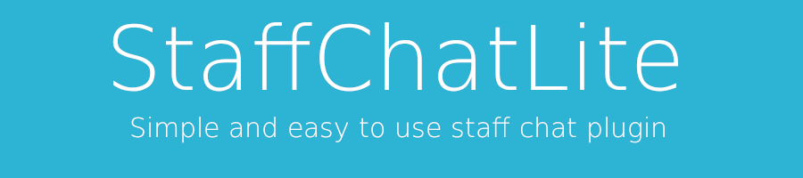

# StaffChatLite - Spigot plugin

### Spigot link
 + [StaffChatLite](https://www.spigotmc.org/resources/staffchatlite.99628/)

### Features
 - Private staff chat channel.
 - Permissions.
 - Liteweight.
 - Fully configurable.
 - Other languages support.
 - Prefix to send staff chat (ie. #)
 - Open source.

### Commands
 - /sc <message> (Send message via staff chat.)
 - /sct (Toggles staff chat)
 - /scadmin help (Shows help)
 - /scadmin reload (Reloads config)

### Permissions
 - staffchatlite.chat (Send and receive staffchat)
 - staffchatlite.help (View help)
 - staffchatlite.toggle (Toggle staffchat)
 - staffchatlite.reload (Reload plugin config)

### Issues? Bugs?
Contact me via Discord: Ddd#7413
Or open an Issue.